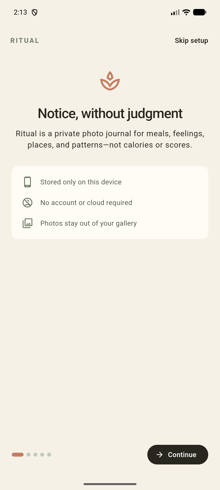
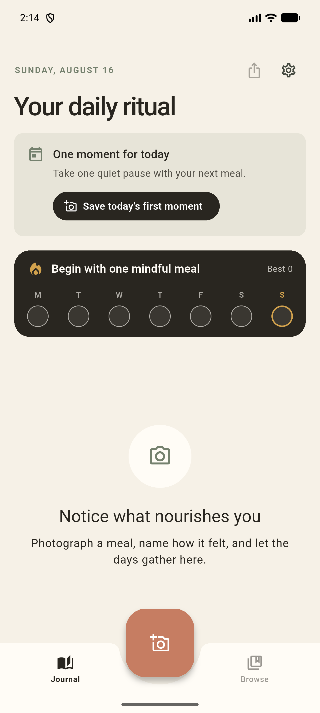

# Ritual

[](https://github.com/ScoutorcusA/ritual-app/actions/workflows/android-release.yml)
[](LICENSE)

Ritual is a private, mindful food photo journal for Android. It helps people remember meals, reflect on feelings and body cues, and notice journal patterns—without calorie counting, food scores, or judgment.

Ritual works on-device with no account, cloud journal, advertising, analytics SDK, subscription, or feature paywall.

[Download the latest APK](https://github.com/ScoutorcusA/ritual-app/releases/tag/ritual-latest) · [Visit the website](https://ritualapp.nishkamk.com) · [Read the wiki](https://github.com/ScoutorcusA/ritual-app/wiki)

> **Status:** Ritual is in active development and is not yet published on Google Play.

## Inside Ritual

<p align="center">
  <a href="web/assets/app-onboarding.png"></a>
  &nbsp;
  <a href="web/assets/app-today.png"></a>
  &nbsp;
  <a href="web/assets/app-reminders.png"></a>
</p>

## Highlights

- Capture breakfast, lunch, dinner, and snacks as private meal photos.
- Add feelings, long reflections, hunger, craving, fullness, and an optional broad place label.
- Revisit daily photo journals, a gallery, a calendar, streaks, and journal-pattern insights.
- Use local reminders that skip meals already photographed and suggest—but never silently apply—time changes.
- Lock the whole app with device authentication or a separate Ritual PIN.
- Export complete ZIP backups or create date-filtered PDF and CSV reports.
- Create privacy-conscious share cards without notes, feelings, dates, or places.
- Choose light, dark, or system appearance and a personal intention for prompts and reminders.

## Privacy

Journal entries and captured photos stay in Android app-private storage. Ritual does not upload journal data or require an account. Approximate location is requested only after the user asks for it; Ritual saves a city-and-country label rather than newly obtained coordinates.

Exports leave Android's private app storage. Full ZIP backups can use AES-256 password protection, while PDF, CSV, and standard ZIP exports are unencrypted for compatibility. See the [privacy policy](web/privacy/index.html) and [wiki](https://github.com/ScoutorcusA/ritual-app/wiki) for the complete model.

## Help translate Ritual

The Android app and website share one volunteer-friendly translation source in [`translations/`](translations/). It covers app screens, reminders, notifications, exports, privacy/support copy, and the website.

To add a language:

1. Copy [`translations/en.json`](translations/en.json) to a locale file such as `translations/es.json`.
2. Update its `_meta` values and translate the values in `strings` without changing the English keys.
3. Preserve placeholders such as `{count}` and `{date}` exactly.
4. Add the locale to [`translations/manifest.json`](translations/manifest.json).
5. Run:

   ```sh
   dart run tool/localization_tool.dart sync-web
   dart run tool/localization_tool.dart check
   flutter test
   ```

Generated files under `web/assets/i18n/` should not be edited directly. The full workflow and review checklist are in [Translations and Languages](wiki/Translations-and-Languages.md).

## Run locally

Install a current Flutter SDK and Android development environment, then run:

```sh
flutter pub get
flutter run
```

Before submitting a change:

```sh
flutter analyze
dart run tool/localization_tool.dart check
flutter test
```

Build a local APK with `flutter build apk --release`. Local release builds use a debug-key fallback unless the release-signing environment variables are provided, so they must not be published as official builds.

## Contributing

Contributions to code, translations, accessibility, documentation, testing, and design are welcome. Start with [CONTRIBUTING.md](CONTRIBUTING.md), the [`good first issue`](https://github.com/ScoutorcusA/ritual-app/labels/good%20first%20issue) label, and the [public roadmap](ROADMAP.md).

Please use synthetic journal content in screenshots, exports, tests, and bug reports. Report vulnerabilities through [SECURITY.md](SECURITY.md).

## Project information

- Detailed behavior, development, signing, release, and Google Play guidance: [Ritual wiki](https://github.com/ScoutorcusA/ritual-app/wiki)
- Source license: [Mozilla Public License 2.0](LICENSE)
- Name, logo, and visual identity: [Trademark policy](TRADEMARKS.md)
- Maintainer-published packages: [Official builds](OFFICIAL_BUILDS.md)
- Website source and deployment: [`web/`](web/)

The Android release workflow analyzes, tests, signs, and publishes a versioned APK after each push to `main`. The rolling [Ritual Latest](https://github.com/ScoutorcusA/ritual-app/releases/tag/ritual-latest) release always points to the newest maintainer-signed build.
