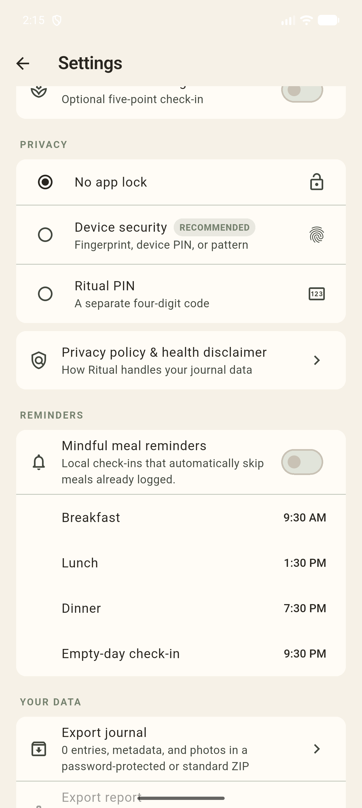
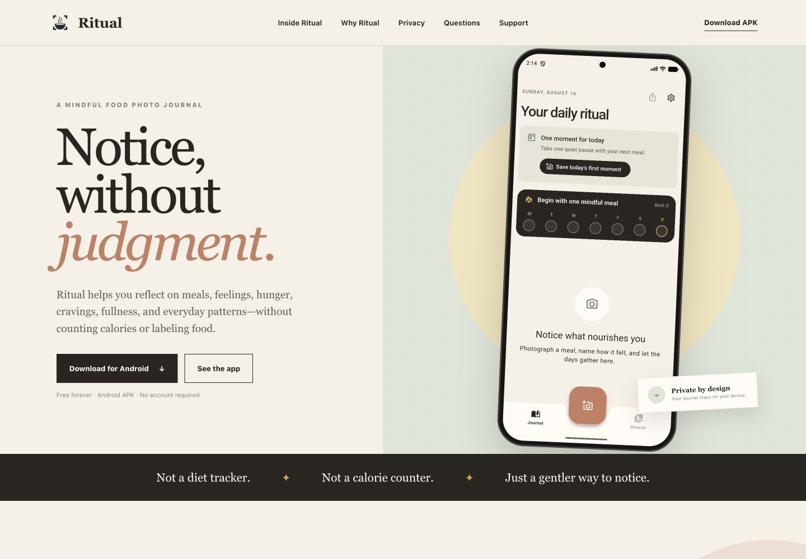
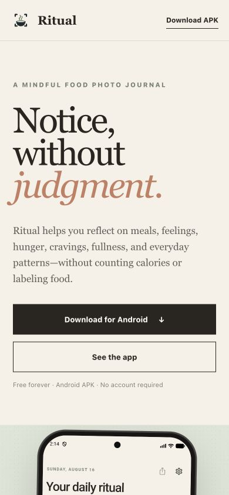

# Building Ritual: From Product Idea to Distribution Pivot

*How I built a private food photo journal, turned product principles into technical decisions, and found a path forward after Google Play became a dead end.*

I did not want to build another calorie counter.

Most food apps are built around numbers, targets, and judgments about whether a meal was “good” or “bad.” I wanted to solve a different problem: **How can someone remember what they ate, reconnect that moment with how they felt, and notice patterns without turning every meal into a score?**

That question became [Ritual](https://ritualapp.nishkamk.com), a private food photo journal for Android. It works without an account, keeps journal data on the device, and avoids calorie tracking, advertising, analytics, subscriptions, and cloud storage.

Building it required more than implementing features. I had to make product, privacy, architecture, testing, and distribution decisions that all supported the same promise: **notice, without judgment.**

## Starting with principles

Before building the interface, I set a few constraints:

- private and local-first;
- reflective rather than prescriptive;
- useful without an account;
- calm enough to use around a real meal;
- portable, so users can leave with their data; and
- free without ads or feature paywalls.

These principles became decision-making tools. A feature did not belong simply because it was possible. It had to help someone reflect without taking control away from them.

*Ritual explains its privacy model before the first journal entry, not in a hidden settings page.*

## Building the smallest useful version

The MVP focused on one complete loop: take a meal photo, add optional context, save it, and find it later.

I built Ritual with Flutter and an Android-first target. SQLite stores journal records, while photos live in the app’s private file storage. Controllers manage journal and settings state, and service classes isolate responsibilities such as reminders, location, and exports.

One early technical challenge was photo ownership. The camera returns a temporary image, but a private journal needs to control that file throughout its lifecycle. Ritual copies the photo into its own protected directory before saving the entry. Canceling removes the copied file, and deleting an entry removes both its database record and photo.

That small architectural choice prevents orphaned images, broken records, and private meal photos appearing in the public gallery.

The interface evolved alongside the architecture. Instead of opening to an empty dashboard, Ritual now presents one clear invitation: save a moment. The journal and weekly rhythm support that action rather than competing with it.

*The home screen focuses on the next useful action instead of overwhelming the user with data.*

## Designing reflection without judgment

Ritual lets users attach feelings, a written reflection, a broad place label, and optional hunger, craving, and fullness check-ins to a photo.

Each body-cue scale can be enabled independently. Turning one off hides it from future forms without deleting previous answers. This reflects a broader product rule: **settings should change the interface, not rewrite someone’s history.**

The insight system follows the same approach. It uses deterministic, threshold-based rules to surface patterns only when enough journal days support them. It does not diagnose, score food, or generate opaque conclusions. The same data always produces the same observation.

Even streaks are optional. They can motivate some users while making others feel judged, so Ritual allows them to be hidden entirely.

## Treating privacy as a complete system

Keeping data off a server was only the beginning. Privacy had to cover capture, storage, locking, location, exports, sharing, debugging, and deletion.

Ritual supports device authentication and a separate app PIN. This feature caused several early bugs around pause, resume, and inactivity behavior. Fixing those problems taught me that security features must be both correct and usable. A lock that constantly interrupts someone will simply be disabled.

Location went through a similar review. Ritual does not need an exact address, so it requests approximate location only after the user asks and stores a broad city-and-country label. Manual entry remains available.

For data portability, Ritual supports full ZIP backups plus date-filtered PDF and CSV reports. Password-protected backups use AES-256 encryption. Imports validate passwords, schemas, manifests, file paths, and photo integrity before accepting an archive.

Share cards use a safer default: they can include recent meal photos but automatically exclude notes, feelings, locations, and dates.

*App locking, local reminders, and data portability are presented as parts of the same privacy experience.*

## Making automation respectful

Notifications looked simple until I considered how they should behave in real life.

Ritual schedules reminders locally, skips a meal that has already been photographed, and lets users edit every reminder time. An adaptive adviser can recognize a stable recent meal pattern, but it waits for several days of evidence and only proposes a change. It never silently edits the schedule.

That became one of my favorite product rules from the project: **suggest, do not silently optimize.** Automation should reduce effort without taking ownership away from the user.

## Turning failures into tests

The test suite grew around the places where the product could fail in meaningful ways.

App-lock bugs produced lifecycle tests. Export work added encryption, corruption, hostile-archive, PDF, and CSV tests. Dark-mode regressions created widget coverage. Reminder failures led to separate checks for permissions, service errors, scheduling, and persistence.

The project currently passes static analysis with no issues and all **67 unit and widget tests** pass. There is also an integration stress test for larger journals.

The important outcome is not the number itself. It is that product promises—privacy, portability, predictable insights, and safe recovery—became executable checks.

## Building the website

Once the app worked, I needed a trustworthy way to explain and distribute it. I built a responsive static website with a custom domain, privacy and support pages, synthetic-data screenshots, and a direct Android download.

The website and app share a translation source, with tooling that validates placeholders and keeps their strings synchronized. GitHub Pages deploys the site automatically after checking its required pages, assets, localization files, and domain configuration.

*The desktop site combines the product message, a real app preview, and a direct download.*

*The mobile layout keeps the same story and makes the download path easy to find.*

The website began as marketing support. It later became part of the distribution strategy.

## The $25 Google Play dead end

My original plan was to publish through Google Play. I paid the **$25 Play Console registration fee** and prepared the expected release work: signing, screenshots, privacy documentation, Data Safety answers, a Health Apps declaration, and a closed-testing plan.

Then I encountered the account-type requirement.

Ritual is not a medical device, but it records feelings and body cues and can produce reports for a clinician. In my Play Console path, that placed it in health-app territory. Google’s guidance directed that category toward an **Organization** developer account, which requires a **D-U-N-S number** for business verification.

I was an individual developer with a newly purchased personal account, not an organization with a D-U-N-S number. In practical terms, I could not take Ritual to production through the account I had paid for.

The frustrating part was not only losing $25. The larger lesson was discovering that distribution is a technical dependency. An app can be built, tested, signed, and documented while still being blocked by the identity requirements of its only distribution platform.

Google documents both the [$25 registration fee](https://support.google.com/googleplay/android-developer/answer/6112435?hl=en) and its [developer account types](https://support.google.com/googleplay/android-developer/answer/13634885?hl=en). Platform rules change, but this was the constraint I faced when preparing Ritual.

## Pivoting to F-Droid and direct distribution

Instead of leaving the finished app in a repository, I changed the distribution plan.

F-Droid was a natural fit. Ritual was already open source, local-first, free of ads and analytics, and independent of Google services or a proprietary backend. Preparing for F-Droid still required real work:

- store-ready descriptions, changelogs, icons, and screenshots;
- clear licenses for source code and original artwork;
- permission for repositories to distribute unmodified builds;
- documentation distinguishing maintainer-signed and repository-signed packages; and
- a migration path for users moving between signing keys.

That last point connected distribution back to the app’s architecture. Android cannot update an installed package with another package signed by a different key. A user moving between GitHub and a repository build may need to export the journal, reinstall the app, and import it again. The backup system became more than a feature—it became the bridge between distribution channels.

Ritual is prepared for the [F-Droid submission process](https://f-droid.org/en/docs/Submitting_to_F-Droid_Quick_Start_Guide/), although I am not claiming it has already been accepted.

In the meantime, every main-branch release is analyzed, tested, signed, and published through GitHub Actions. Permanent versioned APKs preserve release history, while one stable latest-download URL powers the website.

The current strategy has three parts:

1. GitHub Releases for signed, versioned builds and checksums.
2. The Ritual website for discovery, documentation, and direct downloads.
3. F-Droid and similar repositories as future community-reviewed channels.

## What I learned

Ritual reinforced a few lessons I will carry into future projects:

**Define what the product will not do.** Refusing calorie scores, mandatory accounts, tracking, and silent optimization made later decisions clearer.

**Privacy is end-to-end behavior.** Storage, permissions, locking, exports, sharing, and deletion must support the same promise.

**Repeated bugs reveal missing models.** The app-lock fixes were signals that the lifecycle behavior needed a better design and dedicated tests.

**Distribution belongs in the architecture.** Signing, platform eligibility, backups, websites, and release automation affect whether users can actually receive and trust the product.

Most importantly, problem solving is rarely a straight line. I built the smallest honest version, found where its assumptions broke, converted those failures into clearer rules, and made the next version harder to break in the same way.

That loop is what built Ritual—and what helped it survive a major distribution pivot.
